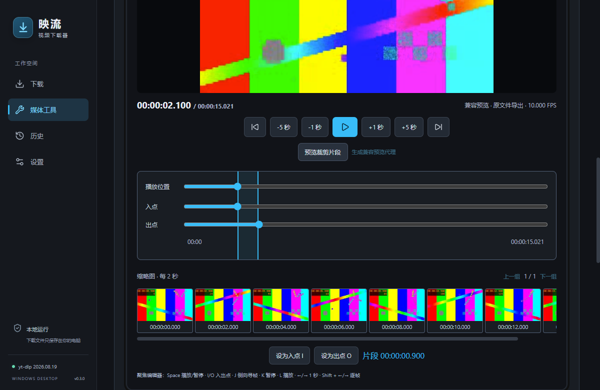
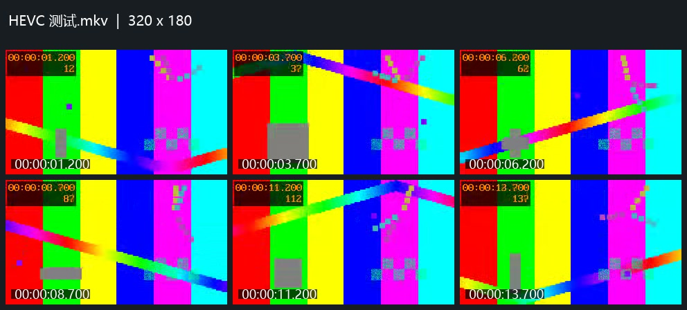

# 映流 v0.3.0 交付与验收

日期：2026-10-11。基于 v0.2.0（`6f81d6d`），完成任务书 P0/P1；版本统一为0.3.0。新分支 `codex/media-pro-v0.3`，草稿PR基于 `codex/ffmpeg-media-tools`（#3），保留现有PR，不合并、不发布GitHub Release。

## 1. 修改文件

相对基线的文件清单如下；另新增本报告、执行记录与 `docs/media-pro-evidence/` 验收数据/截图。

- `README.md`
- `docs/media-pro.md`
- `docs/superpowers/plans/2026-10-11-media-pro.md`
- `docs/superpowers/specs/2026-10-11-media-pro-design.md`
- `docs/superpowers/specs/media-pro-taskbook.md`
- `package-lock.json`
- `package.json`
- `scripts/qa/launch-app.ps1`
- `scripts/qa/verify-media-pro-review-ui.mjs`
- `scripts/qa/verify-media-pro.mjs`
- `scripts/qa/window-check.ps1`
- `src-tauri/Cargo.lock`
- `src-tauri/Cargo.toml`
- `src-tauri/src/ffmpeg/capabilities.rs`
- `src-tauri/src/ffmpeg/command.rs`
- `src-tauri/src/ffmpeg/mod.rs`
- `src-tauri/src/ffmpeg/models.rs`
- `src-tauri/src/ffmpeg/output.rs`
- `src-tauri/src/ffmpeg/probe.rs`
- `src-tauri/src/ffmpeg/runner.rs`
- `src-tauri/src/ffmpeg/tests.rs`
- `src-tauri/src/lib.rs`
- `src-tauri/src/media/automation.rs`
- `src-tauri/src/media/batch.rs`
- `src-tauri/src/media/compressor.rs`
- `src-tauri/src/media/contact_sheet.rs`
- `src-tauri/src/media/gpu.rs`
- `src-tauri/src/media/metadata.rs`
- `src-tauri/src/media/mod.rs`
- `src-tauri/src/media/preset.rs`
- `src-tauri/src/media/subtitle.rs`
- `src-tauri/src/media/thumbnail.rs`
- `src-tauri/src/media/trim/mod.rs`
- `src-tauri/src/media/trim/preview.rs`
- `src-tauri/src/media/trim/processor.rs`
- `src-tauri/src/media/trim/thumbnail.rs`
- `src-tauri/src/media/trim/timeline.rs`
- `src-tauri/src/native.rs`
- `src-tauri/src/service.rs`
- `src-tauri/tauri.conf.json`
- `src/App.tsx`
- `src/components/media/MediaExtrasPanel.tsx`
- `src/components/media/MediaProSettingsPanel.tsx`
- `src/components/media/MediaTaskRow.tsx`
- `src/components/media/batch/BatchPanel.tsx`
- `src/components/media/compress/CompressorPanel.tsx`
- `src/components/media/editor/PlaybackControls.tsx`
- `src/components/media/editor/RangeSelector.tsx`
- `src/components/media/editor/ThumbnailTimeline.tsx`
- `src/components/media/editor/TimelineEditor.tsx`
- `src/components/media/editor/TrimSettings.tsx`
- `src/components/media/editor/VideoPreview.tsx`
- `src/components/media/preset/PresetManager.tsx`
- `src/components/media/subtitle/SubtitlePanel.tsx`
- `src/media.test.ts`
- `src/media.ts`
- `src/pages/MediaToolsPage.tsx`
- `src/styles.css`
- `src/types/media.ts`

## 2. 新增模块

Rust `media/trim` 管理预览、代理、分页缩略图与时间范围；`compressor` 复用受控转码；`preset` 原子保存预设和媒体设置；`automation` 在完成回调及重启时去重入队；`gpu` 与 `ffmpeg/capabilities` 检测实际驱动；`subtitle` 固定文件名暂存与字幕处理；`batch` 安全目录扫描；`thumbnail`、`contact_sheet`、`metadata` 提供抽帧、联系表、封面与标签。下载 service 只新增完成动作调用。

React新增 editor、compress、preset、subtitle、batch组件和媒体附加工具/设置面板；沿用原媒体队列与深色主题。未引入GUI媒体处理库；新增Tauri安全asset范围请求所需传递依赖 `http-range`。

## 3. 完成情况

| 功能 | 本版结果 | 主要边界 |
|---|---|---|
| 可视化裁剪 P0 | 播放、跳转、逐帧、I/O、JKL、毫秒范围同步、选段停止、缩略图、极速/精确导出 | 未知FPS禁逐帧；J倒向寻帧无反向音频；缩略图60张/页 |
| 压缩 P0 | H.264/H.265、三档质量、自定CRF、720/1080/1440/2160p、帧率 | 不放大源画面；AV1预留；CRF不保证固定大小 |
| 媒体预设 P0 | 手机、网页、AI素材、归档及自定义保存/应用/删除 | AI素材另加20张缩略图任务；最多50预设 |
| 完成后动作 P0 | MP4转换、压缩、已有字幕封装、封面；持久来源去重与重启补偿 | 只处理启用后完成的视频；已有字幕，无AI识别 |
| GPU P1 | 编码器声明+实际一帧检测，自动/CPU/NVIDIA/Intel/AMD，失败CPU重试 | 本机无可用GPU，成功加速待真实驱动环境 |
| 字幕 P1 | SRT/ASS/VTT转换、软字幕封装、硬字幕烧录与字体/字号/位置/颜色 | 烧录选外部文本字幕；软封装支持内嵌文本；无位图OCR |
| 批处理 P1 | 多文件/文件夹/拖入，独立任务、错误、取消/重试 | 最多500文件/10000目录项目，不跟随链接/junction |
| 抽帧 P1 | 按间隔、数量、FPS，非空目录发布与编号 | 最多10000张、60FPS |
| 联系表 P1 | 行列、源时间码、中文文件名、尺寸 | 最多10×10 |
| 封面 P1 | 内嵌/首帧提取，MP4/M4A/MP3/FLAC设置 | JPG/PNG，50MiB；音乐单音轨 |
| 元数据 P1 | 标题、Artist/Album/Genre、作者、日期、描述、备注 | 覆盖指定字段，保留兼容封面，单项4096字 |
| 下载/托盘/历史 | 既有行为与下载界面回归通过 | 本轮没有新增个人登录或站点实时下载验收 |
| P2 | AV1、AI识别/处理、媒体库、素材分析预留 | 未宣称完成 |

## 4. 测试结果

| 检查 | 结果 |
|---|---|
| `npm test` | 17/17 |
| `cargo test --manifest-path src-tauri/Cargo.toml --offline` | 53/53，另main/doc无失败 |
| 媒体界面回归 | 14/14 |
| 原下载界面回归 | 13/13 |
| 最终审查回归 | 4/4：倒序单文件/批次扫描、字幕选项、1200/880时间轴同坐标 |
| 最终发布程序真实Windows WebView2 | 16/16：代理播放、区间停止、逐帧、H264/H265、CPU回退、裁剪、字幕、批次、三种抽帧、联系表、封面、标签、取消/进程树、自动动作重启去重 |
| 原文件保护 | 测试源SHA256前后相同；已有输出校验值不变；重复输出自动编号 |

带封面音乐的“设置封面→编辑Artist/Album/Genre→仍有封面和可解码音频”实机通过；带封面MP4与MP3/M4A/FLAC的结构化参数保留映射单测通过。自动动作实机通过独立数据目录中构造已完成下载记录进行重启补偿与再次重启去重，未进行真实网络下载完成的端到端测试。

一次独立最终审查发现四项重要问题，均先看到复现检查失败再修复，通过完整测试；没有未修复Critical/Important。延期一项开发模式Minor见下文。验收原始结果见 `media-pro-evidence/*.json`；脚本 `scripts/qa/verify-media-pro.mjs`、`verify-media-pro-review-ui.mjs`。界面检查需要运行本地5196端口开发服务并加载Playwright；脚本使用此机器现有Playwright路径，换机器请调整路径。媒体实机脚本使用独立状态/合成测试素材；不会使用用户Cookie。

## 5. 构建与安装包

`npm run build` 与 `npm run tauri -- build --bundles nsis` 均通过。中文NSIS，Windows x64，当前用户安装，WebView2 bootstrapper随包；保留开始菜单安装入口。

安装文件：`映流_0.3.0_x64_安装包.exe`，142.30 MiB。
SHA256：`7bdfe5a1db6f9bd458dcc19b345a0c6c4f5116683aa421160de2bc57dfcdd921`。
本机验收运行构建出的发布程序，未覆盖当前已安装应用；干净Win10/缺WebView2完整安装路径尚未实测。源码ZIP由最终Git提交生成，不含node_modules、编译缓存和捆绑大二进制，组件准备方式见README。

组件版本/二进制校验见 `components-verified.json`，来源/许可见捆绑 `THIRD-PARTY-NOTICES.txt` 与licenses；FFmpeg/ffprobe为2026-10-08构建、yt-dlp2026.08.19、Deno2.9.7，本次未升级上游组件。

## 6. 已知限制与延期

开发模式React StrictMode首次模拟清理会永久取消原编辑器会话，导致后续原会话预览/缩略图失败；生产安装版不受这个开发触发影响。已列为延期Minor，下阶段改为每次effect独立会话并补开发模式端到端检查。
真实GPU成功加速/运行中失败重试、物理高DPI、干净Windows安装、个人Cookie/实时站点本轮未实测。默认可使用CPU。原有B站412等源站限制仍可能返回；继承yt-dlp支持范围不代表每个站点当前可用。
代理预览最多6小时、5分钟生成时间、1GiB；生成不完整时拒绝使用。字幕8MiB；音乐标签/封面单音轨；输出容器不兼容时拒绝，避免静默丢弃。未人工验收所有播放器标签显示。

## 7. 下一阶段建议

先处理StrictMode会话并补真实GPU/干净Win10/高DPI验收；再按优先级独立实现AV1、媒体库索引、语音识别字幕和素材分析。多段拼接、多轨非线性编辑及完整设备预设库需另立范围。全部代办与本次裁定见 `media-pro-execution.md`。

GitHub交付：[草稿PR #4](https://github.com/Abaddon145/video_downloader/pull/4)，源码分支 `codex/media-pro-v0.3`。本地交付目录 `artifacts/releases/2026-10-11-media-pro-v0.3.0`，包括中文安装包、Git源码ZIP、SHA256文件、使用说明与验收记录。
